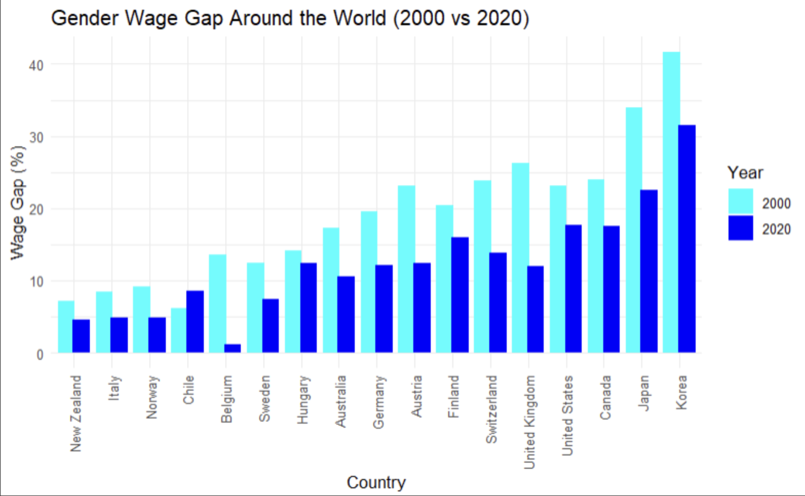
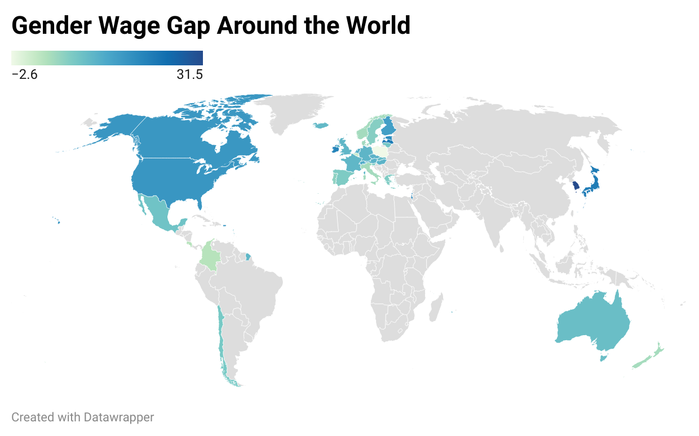

# Gender Economic Inequality
Gender Wage Gap Around the World over the Past Two Decades

**This repository was created as a part of Steven Gotzler's English 105 class during the Spring 2024 semester at the University of North Carolina at Chapel Hill.**

## **Within this repository you will find...**
- A data folder containing the raw Gender Wage Gap dataset and the subset of data created by merging a subset of 2000 data and a subset of 2020 data, utilizing Python3.
- A code folder containing the Python notebook (genderwagegap.ipynb) documenting the process of creating the new subset of data from the raw dataset.

## **What is the purpose of this repository?**
- This repository was created to provide an accessible and reproducible dataset, highlighting the changes in the gender wage gap over the last 20 years around the world. In doing so, awareness is brought to these values, and the countries with the highest and lowest values can be easily found.
- This data can be used by those interested in advocating for lower gender wage gaps and those studying gender economic inequalities, as well as by anyone interested in learning more about the gender wage gaps around the world, in general.

## **Where is this data from?**
This data was accessed from the Organisation for Economic Co-operation and Development (OECD), which brings member countries and partners together to collaborate on global issues at national, regional, and local levels. The original data can be found at [OCED.stat] {https://stats.oecd.org/index.aspx?queryid=54751} 

## **What could this data be used for?**
- This dataset could be used by economic analysts studying and predicting trends, including changes in gender wage gaps.
- Policymakers could take this data into account when implementing plans to combat gender inequalities, specifically in the workplace.
- This data could be used to bring greater public awareness to diversity, equity, and inclusion in the workplace and the disparities in gender-based pay.

## **Data Visualizations**

This visualization of the gender wage gap data of 2000 and 2020 around the world was created R Studio.

This visualization of the gender wage gap data focuses on the geographic aspect of the data through the use of a choropleth map. 

